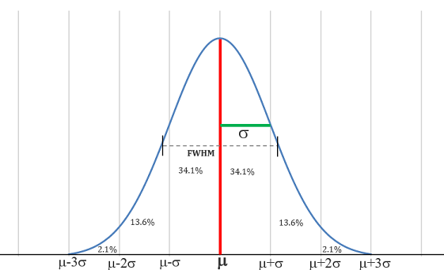

# Data And Sampling Distributions

## Key Terms:
- Sample: A subset from a larger data set.
- Population: The larger data set or idea of a data set.
- N (n): The size of the population (sample).
- Random Sampling: Drawing Elements into a sample at random. available member of the population has an equal chance of being chosen for the sample at each draw. This results in *simple random sample*. Sampling can be done with replacement, in which observations are put back in the population after each draw for possible future reselection. Or it can be done without replacement, in which case observations, once selected, are unavailable for future draws.
- Stratified Sampling: Dividing the population into strata and randomly sampling from each strata. In stratified sampling, the population is divided up into strata, and random samples are taken from each stratum. Political pollsters might seek to learn the electoral pref‐ erences of whites, blacks, and Hispanics. A simple random sample taken from the population would yield too few blacks and Hispanics, so those strata could be over‐ weighted in stratified sampling to yield equivalent sample sizes.
- Stratum (pl., strata): A homogeneous subgroup of a population with common characteristics.
- Simple Random Sample: A sample that results from random sampling without stratifying the population.
- Bias: Systematic error. Statistical bias refers to measurement or sampling errors that are systematic and produced by the measurement or sampling process. An unbiased process will produce errors, but it is random and does not tend strongly in any direction. Bias comes in different forms, and may be observable or invisible. When a result does suggest bias (e.g., by reference to a benchmark or actual values), it is often an indicator that a statistical or machine learning model has been misspecified, or an important variable left out.
- Sample Bias: A sample that misrepresents the population. Sample bias occurs when the difference is meaningful, and it can be expected to continue for other samples drawn in the same way as the first.
- Selection Bias: Bias resulting from the way in which observations are selected.
- Data Snooping: Extensive hunting through data in search of something interesting.
- Vast Search Effect: Bias or non-reproducibility resulting from repeated data modelling, or modelling data with large numbers of predictor variables.
- Sample statistic: A metric calculated for a sample of data drawn from a larger population.
- Data distribution: Frequency distribution of individual values in a data set.
- Sampling Distribution: The frequency distribution of a sample statistic over many samples or resamples.
- Central Limit Theorem: Tendency for sampling distribution to take on a normal shape as sample size rises.
- Standard Error: The variability of a sample statistic over many samples. It is a single metric that sums the variability in the sampling distribution as for a statistic. SE = s/sqrt(n)
- Data quality matters over data quantity. Needs to have completeness, consistency of format, cleanliness, and accuracy of individual data points.

## Size Versus Quality: When Does Size Matter?
Sometimes surprising that smaller is better. Time and effort spent on random sampling not only reduces bias but also allows greater attention to data exploration and data quality. 
- For example, missing data and outliers may contain useful information. It might be prohibitively expensive to track down missing values or evaluate outliers in millions of records, but doing so in a sample of several thou‐ sand records may be feasible. Data plotting and manual inspection bog down if there is too much data.

## Sample Mean Versus Population Mean
The symbol x (pronounced “x-bar”) is used to represent the mean of a sample from a population, whereas μ is used to represent the mean of a population. Why make the distinction? Information about samples is observed, and information about large populations is often inferred from smaller samples. Statisticians like to keep the two things separate in the symbology.

## Selection Bias
To paraphrase Yogi Berra: if you don’t know what you’re looking for, look hard enough and you’ll find it. Selection bias refers to the practice of selectively choosing data—consciously or unconsciously—in a way that leads to a conclusion that is misleading or ephemeral.

Since repeated review of large data sets is a key value proposition in data science, selection bias is something to worry about. A form of selection bias of particular con‐ cern to data scientists is what John Elder (founder of Elder Research, a respected data mining consultancy) calls the vast search effect. If you repeatedly run different models and ask different questions with a large data set, you are bound to find something interesting. But is the result you found truly something interesting, or is it the chance outlier?

We can guard against this by using a holdout set, and sometimes more than one hold‐ out set, against which to validate performance. Elder also advocates the use of what he calls target shuffling (a permutation test, in essence) to test the validity of predic‐ tive associations that a data mining model suggests.

Typical forms of selection bias in statistics, in addition to the vast search effect, include nonrandom sampling (see “Random Sampling and Sample Bias” on page 48), cherry-picking data, selection of time intervals that accentuate a particular statistical effect, and stopping an experiment when the results look “interesting.”

## Regression To the Mean Phenomenon
Regression to the mean refers to a phenomenon involving successive measurements on a given variable: extreme observations tend to be followed by more central ones. Attaching special focus and meaning to the extreme value can lead to a form of selec‐ tion bias.

## Sampling Distribution of a Statistic
The term sampling distribution of a statistic refers to the distribution of some sample statistic over many samples drawn from the same population. Much of classical statis‐ tics is concerned with making inferences from (small) samples to (very large) popula‐ tions.

Typically, a sample is drawn with the goal of measuring something (with a sample sta‐ tistic) or modeling something (with a statistical or machine learning model). Since our estimate or model is based on a sample, it might be in error; it might be different if we were to draw a different sample. We are therefore interested in how different it might be—a key concern is sampling variability. If we had lots of data, we could draw additional samples and observe the distribution of a sample statistic directly.

Typically, we will calculate our estimate or model using as much data as is easily avail‐ able, so the option of drawing additional samples from the population is not readily available.

The distribution of a sample statistic such as the mean is likely to be more regular and bell-shaped than the distribution of the data itself. The larger the sample the statistic is based on, the more this is true. Also, the larger the sample, the narrower the distri‐ bution of the sample statistic.

The histogram of the individual data values is broadly spread out and skewed toward higher values, as is to be expected with income data. The histograms of the means of 5 and 20 are increasingly compact and more bell-shaped

## Central Limit Theorem

The phenomenon we’ve just described is termed the central limit theorem. It says that the means drawn from multiple samples will resemble the familiar bell-shaped normal curve (see “Normal Distribution” on page 69), even if the source population is not normally distributed, provided that the sample size is large enough and the departure of the data from normality is not too great. The central limit theorem allows normal approximation formulas like the t-distribution to be used in calculating sampling distributions for inference—that is, confidence intervals and hypothesis tests.

The central limit theorem receives a lot of attention in traditional statistics texts because it underlies the machinery of hypothesis tests and confidence intervals, which themselves consume half the space in such texts. Data scientists should be aware of this role; however, since formal hypothesis tests and confidence intervals play a small role in data science, and the bootstrap (see “The Bootstrap” on page 61) is available in any case, the central limit theorem is not so central in the practice of data science.

## Standard Error
Page 60-61

## Bootstrap
An easy and effective way to estimate the sampling distribution of a statistic, or of model parameters, is to draw additional samples with replacements, from the sample itself and recalculate the statistic or model for each resample. This is known as bootstrap. 

replicating the original sample thousands or millions of times so that you have a hypothetical population that embodies all the knowledge from your original sample (it’s just larger). You can then draw samples from this hypothetical population for the purpose of estimating a sampling distribution.

Bootstrap can be used with multivariate data, where rows are samples as units. A model may be run on the bootstrapped data, for example, to estimate the stability (variability) of model parameters, or to improve predictive power. With classification and regression trees, running multiple trees on bootstrap samples and then averaging their predictions generally performs better than using a single tree. This process is called bagging or bootstrap aggregating.

The bootstrap can be used with multivariate data, where the rows are sampled as units (see Figure 2-8). A model might then be run on the bootstrapped data, for example, to estimate the stability (variability) of model parameters, or to improve predictive power. With classification and regression trees (also called decision trees), running multiple trees on bootstrap samples and then averaging their predictions (or, with classification, taking a majority vote) generally performs better than using a single tree. This process is called bagging (short for “bootstrap aggregating”; see “Bag‐ ging and the Random Forest” on page 259).

## Resampling vs Bootstrapping
- Resampling comprises permutations and sampling without replacements, whereas bootstrap requires replacement.

## Confidence Intervals
- A way to understand potential errors in a sample estimate.
- Confidence Level: The percentage of confidence intervals, constructed in the same way from the same population, that is expected to contain the statistic of interest.
- C.I. gives us a way to present an estimate not as a single number but as a range.
- An x% confidence interval around a sample estimate should on average contain similar sample estimates x% of the time (when a similar sampling procedure is followed).

The percentage associated with the confidence interval is termed the level of confi‐ dence. The higher the level of confidence, the wider the interval. Also, the smaller the sample, the wider the interval (i.e., the greater the uncertainty). Both make sense: the more confident you want to be, and the less data you have, the wider you must make the confidence interval to be sufficiently assured of capturing the true value.

## Normal Distribution / Gaussian Distribution.

## Standard Normal and QQ-Plots

- Bell-shaped distribution.
- Error: Difference between a data point and a predicted or average value.
- Standardize: Subtract the mean and divide by the standard deviation.
- z-score: The result of standardizing an individual data point
- Standard Normal: A normal distribution with mean = 0 and standard deviation = 1.
- QQ plot: A plot to visualize how close a sample distribution is to a specified distribution, e.g. to the normal distribution.

- To compare data to a standard normal distribution, you subtract the mean and then divide by the standard deviation; this is also called normalization or standardization. The transformed value is termed a z-score; the normal distribution is sometimes called the z-distribution.
- A QQ plot orders the z-score from low to high and plots each value's z-score on the y-axis; the x-axis is the corresponding quantile of a normal distribution for the value's rank. Since the data is normalized, each value corresponds to the number of standard deviations away from the mean. If the points roughly fall on the diagonal line, then the sample distribution can be considered close to normal.

## Long-Tailed Distribution
-  Data is generally not normally distributed.
-  Tail: The long narrow portion of a frequency distribution, where relatively extreme values occur at a low frequency.
-  Skew: Where one tail of a distribution is longer than the other.
-  Sometimes distribution is highly skewed, such as with income data.
-  Nassim Taleb has proposed the black swan theory, which predicts that anomalous events, such as stock market crashes, are more likely to occur than would be predicted by the normal distribution.

## T-Distribution
- T-distribution is a normally shaped distribution, except that it is a bit thicker and the longer on the tails. It is used extensively in depicting distributions of sample statistics. The larger the sample the more normally shaped the t-distribution becomes.
- n: sample size.
- Degrees of freedom: A parameter that allows the t-distribution to adjust to different sample sizes, statistics, and number of groups.

## Student's t-Distribution
- Refer to pages 75-78

## Binomial Distribution
- Trial: An event with a discrete outcome.
- Success: The outcome of interest in a trial
- Binomial: Having 2 outcomes only.
- Binomial Trial / Bernoulli Trial: A trial with 2 outcomes.
- Binomial Distribution / Bernoulli Distribution: Distribution of number of successes in x trials.

The binomial distribution is the frequency distribution of the number of successes (x) in a given number of trials (n) with a specified probability (p) of success in each trial. There is a family of binomial distributions, depending on the values of n and p. The binomial distribution would answer a question like: *If the probability of a click converting to a sale is 0.02, what is the probability of observing 0 sales in 200 clicks?*

## Chi-Square Distribution
- An important idea in statistics is a departure from expectation, especially with respect to category counts. Expectation is defined loosely as nothing unusual or of note in the data (e.g., no correlation between variables or predictable patterns). This is also termed the null hypothesis or null model. The statistic that measures the extent to which the results depart from the null expectation of independence is the chi-square statistic.

- Chi-square statistic is a measure of the extent to which a set of observed values fits a specified distribution (goodness of a fit test).
- The chi-square distribution is the distribution of the chi-square statistic under a repeated resample drawn from the null model. A low chi-square metric means closer to distribution and vice versa.

## F Distribution
- The F statistic compares variation due to  factors of interest to overall variance. (ANOVA / Analysis of variance).
- F distribution is used with experiments and linear models involving measured data.

## Poission And Related Distributions

- Lambda: The rate per unit of time or space at which an event occurs.
- Poisson Distribution: Frequency distribution  of the number of events in sampled units of time or space.
- Exponential Distribution: The frequency distribution of the time or distance from one event to the next event.
- Weibull Distribution: A generalized version of the exponential distribution in which the event rate is allowed to shift over time/ not constant.
- The Poisson distribution is useful for answering queueing questions such as: How much capacity do we need to be 95% sure of fully processing the internet traffic that arrives on a server in any five-second period?

